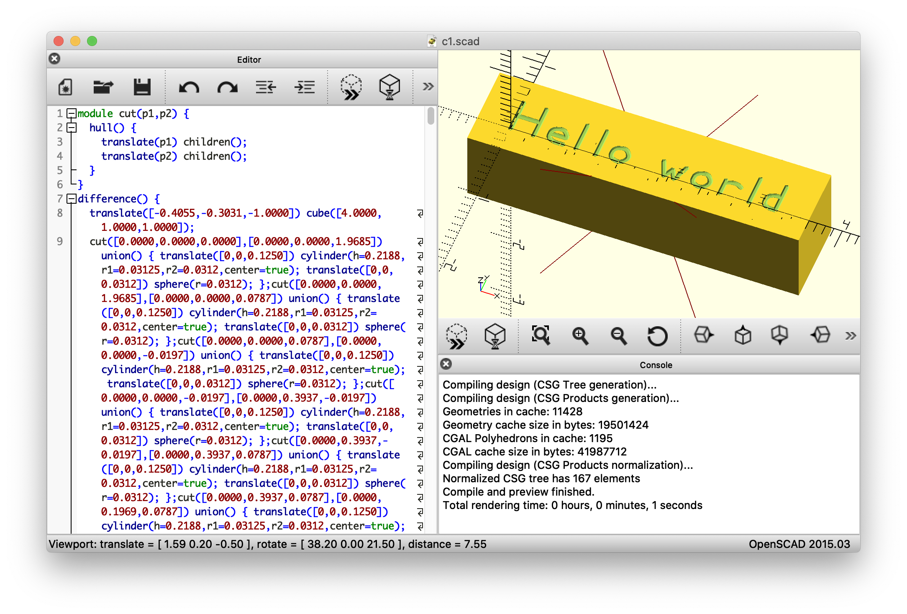

# RS274/NGC (GCODE) Parser/Interpreter in Python3

Antlr4-based parser and interpreter for the GCode dialect described in ["The NIST RS274NGC Interpreter - Version 3" by Thomas Kramer Frederick, Thomas R. Kramer, Frederick M. Proctor, and Elena Messina](https://www.nist.gov/publications/nist-rs274ngc-interpreter-version-3), written in Python3.

https://www.nist.gov/publications/nist-rs274ngc-interpreter-version-3

DISCLAIMER: This was written as an exercise, to gain a better understanding of GCode. It is incomplete and almost certainly contains errors. Use at your own risk.


## Parser

Antlr4 grammar and generated classes for Python3:
* GCode.g4
* GCodeLexer.py
* GCodeParser.py
* GCodeListener.py
* GCodeVisitor.py

The grammar doesn't contain any embedded actions, so it can be used as-is to target languages other than Python3.

## Interpreter

Interpreter and support classes:
* GCodeInterpreter.py
* GCodeFormatter.py
* GCodeExprEvaluator.py
* GCodeParamMemory.py

The <code>GCodeInterpreter</code> visitor class executes program lines (blocks) in the parse tree using an idealized machine model capable of infinite acceleration/deceleration. Circular/helical movements are approximated with a series of linear movements. <code>GCodeInterpreter</code> calls <code>onMove</code> with each linear movement and tracks min/max travel, distance moved, and estimated runtime as it goes. Internal units are inches and minutes.

The <code>GCodeFormatter</code> visitor class reconstructs a string representation of the program in the parse tree.

The <code>GCodeExprEvaluator</code> visitor class evaluates value nodes in the parse tree, including any expressions and parameter values they contain. The <code>GCodeParamMemory</code> class stores parameter values.

See the sample programs for examples of <code>GCodeFormatter</code> and <code>GCodeInterpreter</code> usage.

Supported G Codes (from Table 5):
| Code  | Support | Description |
| ----  | ----    | ---- |
| G0    | Y | rapid positioning |
| G1    | Y | linear interpolation |
| G2    | Y | circular/helical interpolation (clockwise) |
| G3    | Y | circular/helical interpolation (counterclockwise) |
| G4    | Y | dwell |
| G10   | Y | coordinate system origin setting |
| G17   | Y | XY-plane selection |
| G18   | Y | XZ-plane selection |
| G19   | Y | YZ-plane selection |
| G20   | Y | inch system selection |
| G21   | Y | millimeter system selection |
| G28   | Y | return to home |
| G30   | Y | return to secondary home |
| G38.2 |   | straight probe |
| G40   |   | cancel cutter radius compensation |
| G41   |   | start cutter radius compensation left |
| G42   |   | start cutter radius compensation right |
| G43   |   | tool length offset (plus) |
| G49   |   | cancel tool length offset |
| G53   | Y | motion in machine coordinate system |
| G54   | Y | use preset work coordinate system 1 |
| G55   | Y | use preset work coordinate system 2 |
| G56   | Y | use preset work coordinate system 3 |
| G57   | Y | use preset work coordinate system 4 |
| G58   | Y | use preset work coordinate system 5 |
| G59   | Y | use preset work coordinate system 6 |
| G59.1 | Y | use preset work coordinate system 7 |
| G59.2 | Y | use preset work coordinate system 8 |
| G59.3 | Y | use preset work coordinate system 9 |
| G61   | Y | set path control mode: exact path |
| G61.1 | Y | set path control mode: exact stop |
| G64   | Y | set path control mode: continuous |
| G80   | Y | cancel motion mode (including any canned cycle) |
| G81   |   | canned cycle: drilling |
| G82   |   | canned cycle: drilling with dwell |
| G83   |   | canned cycle: peck drilling |
| G84   |   | canned cycle: right hand tapping |
| G85   |   | canned cycle: boring, no dwell, feed out |
| G86   |   | canned cycle: boring, spindle stop, rapid out |
| G87   |   | canned cycle: back boring |
| G88   |   | canned cycle: boring, spindle stop, manual out |
| G89   |   | canned cycle: boring, dwell, feed out |
| G90   | Y | absolute distance mode |
| G91   | Y | incremental distance mode |
| G92   | Y | offset coordinate systems and set parameters |
| G92.1 | Y | cancel offset coordinate systems and set parameters to zero |
| G92.2 | Y | cancel offset coordinate systems but do not reset parameters |
| G92.3 | Y | apply parameters to offset coordinate systems |
| G93   |   | inverse time feed rate mode |
| G94   | Y | units per minute feed rate mode |
| G98   |   | initial level return in canned cycles |
| G99   |   | R-point level return in canned cycles |

Supported M Codes (from Table 7):
| Code  | Support | Description |
| ----  | ----    | ---- |
| M0    | Y | program stop |
| M1    | Y | optional program stop |
| M2    | Y | program end |
| M3    | Y | turn spindle clockwise |
| M4    | Y | turn spindle counterclockwise |
| M5    | Y | stop spindle turning |
| M6    | Y | tool change |
| M7    | Y | mist coolant on |
| M8    | Y | flood coolant on |
| M9    | Y | mist and flood coolant off |
| M30   | Y | program end, pallet shuttle, and reset |
| M48   | Y | enable speed and feed overrides |
| M49   | Y | disable speed and feed overrides |
| M60   | Y | pallet shuttle and program stop |

## Sample Programs

### gcodeParse.py

Parse the program.

With the -v flag, prints the antlr4 parse tree.

```
% ./gcodeParse -h
Usage: gcodeParse.py [options] file.ngc ...

Options:
  -h, --help  show this help message and exit
  -v          verbose output
```

```
% ./gcodeParse.py references/c1.ngc
references/c1.ngc
```

### gcodePrint.py

Print the parsed program.

```
% ./gcodePrint -h
Usage: gcodePrint.py [options] file.ngc ...

Options:
  -h, --help  show this help message and exit
  -v          verbose output
```

```
% ./gcodePrint.py references/c1.ngc
references/c1.ngc
(this program mills "Hello world" between X=0 and X=81 millimeters)
n0010 g 21 g 0 x 0 y 0 z 50 (top of part should be on XY plane)
n0020 t 1 m 6 m 3 f 20 s 4000 (use an engraver or small ball-nose endmill)
n0030 g 0 x 0 y 0 z 2
n0040 g 1 z -0.5 (start H)
n0050 y 10
n0060 g 0 z 2
...
n0560 g 1 z -0.5 (start d)
n0570 y 0
n0580 x 79.5
n0590 g 2 j 2.5 y 5
n0600 g 1 x 81
n0610 g 0 z 50
```

### gcodeRun.py

Interpret the program and print min/max travel, distance moved, estimated runtime.

With the -v flag, prints each line of the program as it is executed.

```
% ./gcodeRun.py -h
Usage: gcodeRun.py [options] file.ngc ...

Options:
  -h, --help  show this help message and exit
  -v          verbose output
```

```
% ./gcodeRun.py references/c1.ngc
references/c1.ngc
min [0.0000 0.0000 -0.0197]
max [3.1890 0.3937 1.9685]
size [3.1890 0.3937 1.9882]
dist 17.1378 in
time 9.21 sec
```

```
% ./gcodeRun.py -v references/c2.ngc 
references/c2.ngc
n0010 g 21 g 1 x 3 f 20 (expression test)
g 21.0000
g 1.0000
x 3.0000
f 20.0000
n0020 x [1 + 2] (x should be 3)
x 3.0000
n0030 x [1 - 2] (x should be -1)
x -1.0000
...
n0410 x [2 ** 3.0] #1=2.0 (x should be 8.0)
x 8.0000
n0420 ##1=0.375 (#1 is 2, so parameter 2 is set to 0.375)
n0430 x #2 (x should be 0.375) #3=7.0
x 0.3750
n0440 #3=5.0 x #3 (parameters set in parallel, so x should be 7, not 5)
x 7.0000
n0450 x #3 #3=1.1 (parameters set in parallel, so x should be 5, not 1.1)
x 5.0000
n0460 x [2 + asin[1 / 2.1 + -0.345] / [atan[fix[4.4] * 2.1 * sqrt[16.8]]/[-18]] ** 2]
x 2.0005
n0470 x sqrt[3 ** 2 + 4 ** 2] (x should be 5.0)
x 5.0000
...
```

### gcodePlot.py

Interpret the program and plot the tool path.

```
% ./gcodePlot -h
Usage: gcodePlot.py [options] file.ngc ...

Options:
  -h, --help  show this help message and exit
  -v          verbose output
```

```
% ./gcodePlot.py references/c1.ngc
```


### gcodeScad.py

Interpret the program and generate an OpenSCAD script to subtract a tool shape from a block of stock while moving along the tool path.

```
% ./gcodeScad.py -h
Usage: gcodeScad.py [options] file.ngc ...

Options:
  -h, --help          show this help message and exit
  -v                  verbose output
  --tool_type=value   tool type (0 = square, 1 = ball, 2 = engraving)
  --tool_diam=value   tool diameter (inches)
  --tool_doc=value    tool depth of cut (inches)
  --stock_size=X,Y,Z  stock size (inches)
  --stock_pos=X,Y,Z   stock position (inches)
  --fn=value          $fn override
```

```
% ./gcodeScad.py --tool_type 1 --tool_diam 0.0625 --tool_doc 0.25 references/c1.ngc
```


## Requirements

* Python3 (https://www.python.org)
* Antlr4 (https://www.antlr.org)

On MacOS:
```
% brew install python3
% brew install antlr
% pip3 install antlr4-python3-runtime
```
